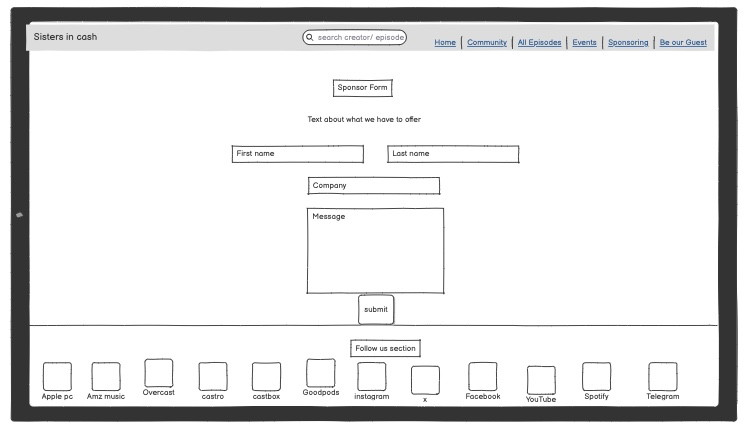
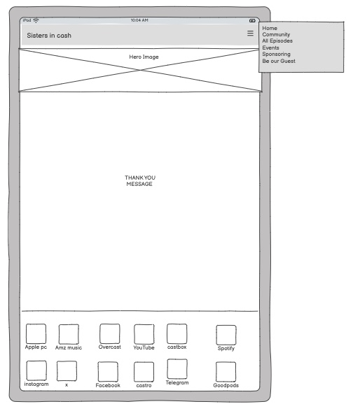
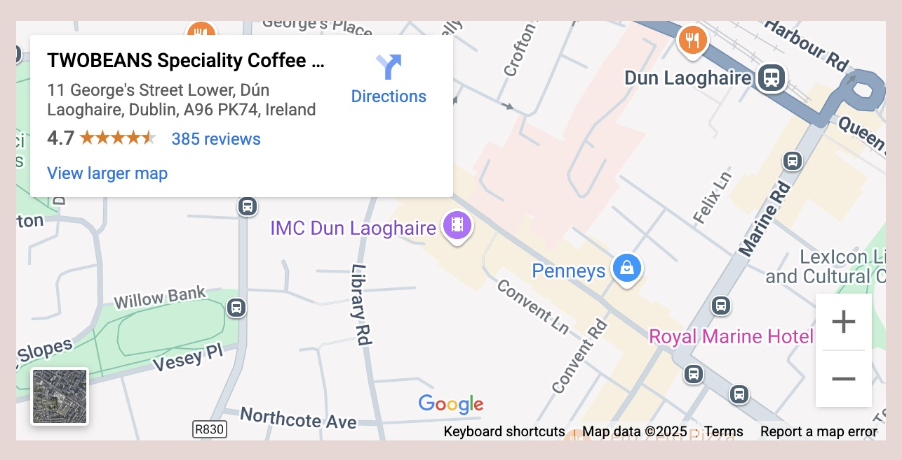
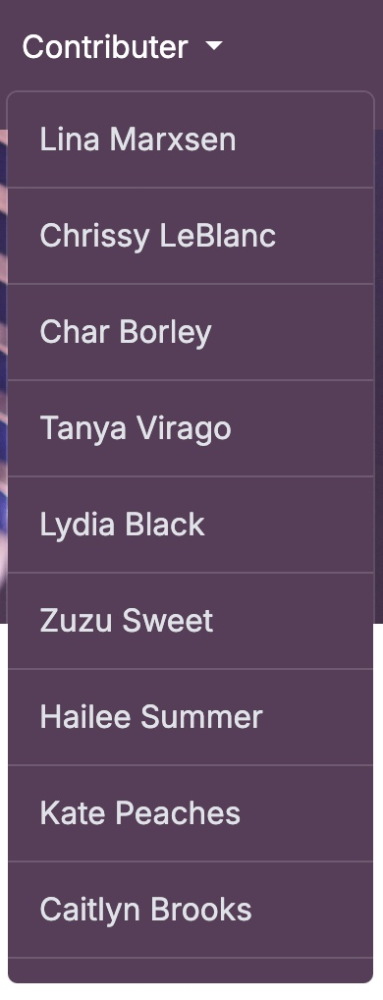
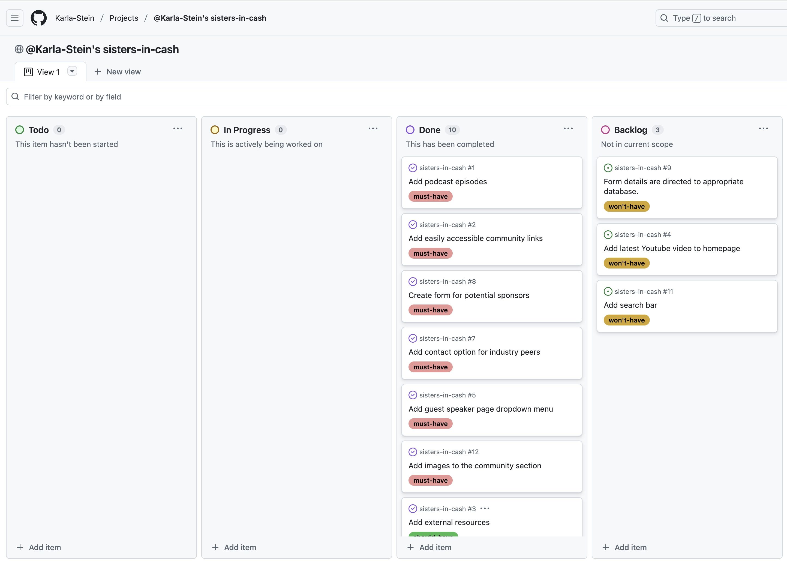

# [sisters-in-cash](https://karla-stein.github.io/sisters-in-cash)

Developer: Karla Steinbrink ([karla-stein](https://www.github.com/karla-stein))

PROJECT INTRODUCTION

This project is the official website for a podcast supporting adult content creators navigating the complex and rapidly evolving world of digital content creation. More than just a place to host episodes, the site functions as a central hub for education, peer support, and industry transparency.

The platform aims to shed light on key topics often left in the dark — from content ownership and copyright protection to legal risks, platform policies, and the rise of AI in content creation. Through in-depth conversations with creators, legal experts, and digital strategists, the podcast offers valuable insight into building a secure, profitable, and sustainable creator business.

The site is designed to support:
- Listeners looking for real-world advice on monetization, protection, and growth
- Peers seeking a trusted community to share tools, experiences, and opportunities
- Sponsors exploring targeted, high-impact audience placements
- Guest speakers with valuable stories or expertise to contribute

Although the project is still in its early stages, the long-term goal is to grow both the podcast and the community — helping creators take ownership of their work, protect their rights, and scale their digital presence with confidence.

source: [sisters-in-cash amiresponsive](https://ui.dev/amiresponsive?url=https://karla-stein.github.io/sisters-in-cash)

## UX

### The 5 Planes of UX

#### 1. Strategy

**Purpose**
The purpose of this website is to serve as the official platform for a podcast 
that supports adult content creators by providing educational content, industry 
insights, and access to a peer-driven community.

**Primary User Needs**
- Access credible, industry-specific insights
- Listen to podcast episodes that are relevant to their journey
- Join a trusted and supportive community

**Business Goals**
- To grow the podcast’s reach and build a loyal following of engaged listeners.
- To attract and onboard sponsors who want access to their perfect target audience.
- To build a safe space for a growing online-community.

#### 2. Scope

**[Features](#features)** 

**Content Requirements**
- Clear and pupose driven text that explains the podcast's mission.
- Description and media for all podacst episodes.
- A guest speaker dropdown menu that links to relevant episodes.
- Prominent link to join the community space.
- A guest applicatiom form for creators.
- A sponsorship inquiry form for brands.
- External resources to verify credibility.
- A regular updated section highlighting upcoming events.

#### 3. Structure

**Information Architecture**
- **Navigation Menu**:
  - Accessible links in the navbar, including Home, Community, All Episodes, Events, Be our guest, Sponsoring and 
  a dropdown of all podcast contributer.
- **Hierarchy**:
  - Clear call-to-action's
  - Prominent placement of social media links in the footer.

**User Flow**
1. User lands on the homepage - reads a brief overview of the podcast’s mission and sees the latest episode.
2. Navigates to the All Episodes page - listens to content covering content-creation, -protection, and -monetization topics.
3. Visits the Community section - learns how to join and why it’s valuable for peers.
4. Opens the Events page - checks upcoming talks or collaborations.
5. Goes to the Guest or Sponsor form - submits application to be featured or partner with the podcast.

#### 4. Skeleton

**[Wireframes](#wireframes)**

To follow best practice, wireframes were developed for mobile, tablet, and desktop sizes.
I've used [Balsamiq](https://balsamiq.com/wireframes) to design my site wireframes.

| Page | Mobile | Tablet | Desktop |
| --- | --- | --- | --- |
| Home |  |  |  |
| All Episodes |  |  |  |
| Sponsoring |  |  |  |
| Confirmation |  |  |  |
| 404 |  |  |  |

#### 5. Surface

**Visual Design Elements**
- **[Colours](#colour-scheme)** 
- **[Typography](#typography)** 
- **[Iconography](#iconography)**

### Colour Scheme

I used [imagecolorpicker.com](https://imagecolorpicker.com/) to generate my color palette.

The visual identity of this project is intentionally soft yet bold — designed to resonate 
with the podcast’s audience: independent, creative, and ambitious content creators navigating 
a vulnerable and fast-moving industry.

| Colour | Hex | Meaning & Purpose | Colour Visualisation |
| --- | --- | --- | --- |
| Deep Plum | #5A3C5A | A strong, grounding base color. Symbolizes authority, depth, and sophistication — ideal for establishing credibility and seriousness in sensitive topics like legal protection and monetization. |  |
| Muted Rose | #B4727F | Warm and approachable. This color conveys compassion and vulnerability, reflecting the podcast’s mission to build trust and create a safe space for real conversations. |  |
| Lavender Mist | #E1B8E7 | Light and imaginative. It nods to creativity, femininity, and innovation — aligning with the podcast’s focus on new tools, platforms, and AI-driven workflows. |  |
| Soft Blush | #EAD6D3 | Clean and minimal. Used for balance, space, and background elements to keep the interface light and readable while reinforcing a sense of calm and care. |  |

Together, these colors evoke a feminine but powerful energy — blending emotional intelligence with digital confidence. They were chosen not only for visual harmony but to represent the heart of the podcast: unfiltered truth, bold growth, and unapologetic ownership in a space that often lacks transparency.

- primary-color: #5a3c5a;
- secondary-color: #b4727f;
- highlight-color: #E1B8E7;
- highlight-color-light: #ead6d3;

### Typography

This project uses two Google Fonts:
- Chivo (for headings):
A bold, modern sans-serif typeface that creates a sense of clarity and authority. It was chosen to give the podcast a confident visual voice and help important sections — such as titles, CTAs, and headers stand out with impact.
- Inter (for body text):
A versatile and highly readable font optimized for digital use. Inter ensures that long-form content, episode descriptions, and informational text are easy to consume, even on smaller screens.

The combination of Chivo and Inter offers a strong visual hierarchy, blending a bold, editorial feel with clean readability — perfectly aligned with the podcast’s mission to educate, empower, and inform creators.

- [Chivo](https://fonts.google.com/specimen/Chivo) was used for all headings.
- [Inter](https://fonts.google.com/specimen/Inter) was used for the body text. 

### Iconography

This project uses Font Awesome via CDN to integrate lightweight, scalable icons across the site.
- Why Font Awesome?
It offers a wide selection of professional, consistent icons that are widely supported across modern browsers and devices.
- How it’s used:
Icons are used selectively to represent social media platforms in the footer and to display the copyright symbol — enhancing clarity and professionalism without adding unnecessary visual noise.

Font Awesome helps support a clean, user-friendly interface while maintaining performance and flexibility as the site grows.

[Fontawesome](https://fontawesome.com/)

## User Stories

| Target | Expectation | Outcome |
|--------|-------------|---------|
| As a content creator | I want to easily find new podcast episodes | so that I can learn from my peers’ tactics and real experiences. |
| As a new user | I want to easily find the community links | so that I can benefit from exclusive insights shared within the community. |
| As a new user | I need to find links to external resources | so that I can verify the credibility of the podcast or its guests. |
| As a sponsor | I need to find a contact form | so that I can express interest in sponsoring the podcast. |
| As an industry peer | I need to find a contact form | so that I can express interest in being featured as a guest. |
| As a sponsor | I need to view a list of featured guest speakers | so that I can evaluate if they align with my brand or product before sponsoring. |
| As an industry peer | I need to view upcoming events | so that I can decide if I want to participate or collaborate. |
| As a visual-first user | I want to easily find the latest podcast video | so that I can engage with the content in a way that suits my preferences. |
| As the podcast host | I want to receive notifications or view form submissions | so that I can respond to sponsorship and guest inquiries promptly. |
| As a user | I want to see a custom 404 error page when I land on a broken or non-existent link | so I know I’ve made a mistake and can easily navigate back to the site. |
| As a user | I want to use a search bar to quickly find specific podcast episodes or topics | so I don’t have to scroll through all content manually. |
| As a new user | I want to view a carousel of community images in the community section | so I can get a visual sense of the people, vibe, and value of joining the network. |
| As a user interested in attending events | I want to view a map with the event location | so I can easily understand where it’s taking place and plan my visit. |

## Features
### Existing Features 

| Feature | Notes | Screenshot |
| --- | --- | --- |
| Navbar | Displayed consistently across all pages, the fully responsive navbar includes links to key site areas: Home, Community, All Episodes, Events, Be Our Guest, Sponsoring and a Contributer dropdown menu. On smaller screens, a burger menu is used to toggle visibility, ensuring easy navigation on mobile devices. The navbar is fixed for persistent access while scrolling. |  |
| Hero Section | The homepage opens with a strong introduction that highlights the podcast’s mission and invites visitors to listen to the latest episode. This section helps new users immediately understand what the site and podcast are about. |  |
| All Episodes Page | This section showcases all available podcast episodes, including guest-speaker name, titles, brief summaries, embedded audio players and external link to the guest speakers Instagram. |  |
| Community Section | Prominently featured on the homepage, this section invites users to join the private community where exclusive insights and peer support are shared. This feature builds trust and ongoing engagement with the audience. |  |
| Community Carousel | The community section includes a responsive image carousel showcasing real visuals that reflect the vibe, diversity, and value of the network. It allows users to scroll through images to get a stronger sense of connection and trust, encouraging them to explore or join the community. |  |
| Events Section | The Events section allows users and collaborators to view upcoming podcast-related events or Talks. Each event includes a title, date, and where it's held, with optional links to get in touch. |  |
| Google Map| The events section includes a fully responsive Google Map. This allows users to visually understand where events are held, explore the surrounding area, and plan their attendance more easily. |  |
| Guest Application Form | This form allows industry peers and creators to apply to be featured on the podcast. It collects key information such as name, social handle, contact details and allows to leave a message making the guest onboarding process streamlined. | |
| Sponsor Form | This form enables sponsors to express interest in partnering with the podcast. The form includes fields for name, company name, company website, contact info and it allows to leave a message giving sponsors confidence that their inquiry will be taken seriously. |  |
| Contributer Directory | A dedicated dropdown menu showcasing guest speakers linking to relevant episodes. This helps sponsors assess alignment and also gives credibility to the podcast. |  |
| Success Page | After form submission, users are directed to a confirmation page thanking them for their inquiry. It provides reassurance that their message has been received and reinforces a smooth, professional experience. |  |
| 404 Page | A custom 404 page is included to guide users who land on a non-existent page. Styled to match the rest of the site, it helps users recover quickly and enhances professionalism. |  |
| Footer | The footer includes social media links and legal information. All external links open in new tabs to maintain a seamless experience. This section encourages ongoing connection outside the site. |  |

### Future Features

- **Valid destination for form data**: Allows Podacst host to view form submissions where they can can respond to inquiries promptly.
- **Video content**: Embedd latest youtube video for regular users that prefer visuals over audio-only listening. 
- **Search bar**: Allow users to search by guest, topic, or keyword to find the most relevant episodes for their needs. 

## Tools & Technology

| Tool / Tech | Use |
| --- | --- |
|  | Generate README and TESTING templates. |
|  | Version control. (`git add`, `git commit`, `git push`) |
|  | Secure online code storage. |
|  | Local IDE for development. |
|  | Main site content and layout. |
|  | Design and layout. |
|  | Hosting the deployed front-end site. |
|  | Front-end CSS framework for modern responsiveness and pre-built components. |
|  | Creating wireframes. |
|  | Creating colour visualisation for README. |
|  | Icons. |
|  | Help with creating clear and audience aligned text for all pages.  |
|  | Tutorials/Reference Guide |
|  | Troubleshooting and Debugging |
|  | Help debug, troubleshoot, and explain things. |

## Agile Development Process

### Github Projects

[GitHub Projects](https://www.github.com/karla-stein/sisters-in-cash/projects) 

GitHub Projects was used to manage the project in an Agile, user-centered way. A Kanban board was created to visually track progress and organize tasks across the development timeline, supporting a clear and iterative workflow.

This approach helped focus development on real user goals, avoid scope creep, and deliver a meaningful MVP without overloading the build with non-essential features.

### GitHub Issues

[GitHub Issues](https://www.github.com/karla-stein/sisters-in-cash/issues) 
served as an another Agile tool. There, I managed my User Stories and Milestone tasks, and tracked any issues/bugs.

| Link | Screenshot |
| --- | --- |
|  |  |
|  |  |

### MoSCoW Prioritization

To keep things focused and avoid getting overwhelmed, I used the MoSCoW method to organise my tasks inside the GitHub Project board. I broke down my bigger ideas (epics) into smaller, actionable user stories and then grouped them by priority.

This made it much easier to see what absolutely needed to get done — and what could wait until later.

Here’s how I prioritised:
- Must Have – These were non-negotiable. Core features that had to be delivered first.
- Should Have – Adds real value, but weren’t essential to make the site work.
- Could Have – Nice-to-have extras with small impact if left out. 
- Won’t Have (for now) – A feature I’d love to add in future versions but don’t yet have the technical skills to implement. They’ve been documented for future iterations.

This method helped me stay focused on delivering a functional, meaningful site without getting lost in the details too early.

## Testing

## Deployment

### GitHub Pages

The site was deployed to GitHub Pages. The steps to deploy are as follows:

- In the [GitHub repository](https://www.github.com/karla-stein/sisters-in-cash), navigate to the "Settings" tab.
- In Settings, click on the "Pages" link from the menu on the left.
- From the "Build and deployment" section, click the drop-down called "Branch", and select the **main** branch, then click "Save".
- The page will be automatically refreshed with a detailed message display to indicate the successful deployment.
- Allow up to 5 minutes for the site to fully deploy.

The live link can be found on [GitHub Pages](https://karla-stein.github.io/sisters-in-cash).

### Local Development

This project can be cloned or forked in order to make a local copy on your own system.

#### Cloning

You can clone the repository by following these steps:

1. Go to the [GitHub repository](https://www.github.com/karla-stein/sisters-in-cash).
2. Locate and click on the green "Code" button at the very top, above the commits and files.
3. Select whether you prefer to clone using "HTTPS", "SSH", or "GitHub CLI", and click the "copy" button to copy the URL to your clipboard.
4. Open "Git Bash" or "Terminal".
5. Change the current working directory to the location where you want the cloned directory.
6. In your IDE Terminal, type the following command to clone the repository:
	- `git clone https://www.github.com/karla-stein/sisters-in-cash.git`
7. Press "Enter" to create your local clone.

Alternatively, if using Gitpod, you can click below to create your own workspace using this repository.

**Please Note**: in order to directly open the project in Gitpod, you should have the browser extension installed. A tutorial on how to do that can be found [here](https://www.gitpod.io/docs/configure/user-settings/browser-extension).

#### Forking

By forking the GitHub Repository, you make a copy of the original repository on our GitHub account to view and/or make changes without affecting the original owner's repository. You can fork this repository by using the following steps:

1. Log in to GitHub and locate the [GitHub Repository](https://www.github.com/karla-stein/sisters-in-cash).
2. At the top of the Repository, just below the "Settings" button on the menu, locate and click the "Fork" Button.
3. Once clicked, you should now have a copy of the original repository in your own GitHub account!

### Local VS Deployment

There are no remaining major differences between the local version when compared to the deployed version online.

## Credits

Content & Design Inspiration
- Inspiration for this project was drawn from best practices taught in the Code Institute course and concepts explored in the walkthrough projects, but all decisions around layout, structure, and content flow were made independently.

README Guidance
- The overall structure, formatting, and flow of this README were guided by my mentor, Tim Nelson, whose input helped shape a clear and professional documentation style throughout.

Code References & Tutorials
- Code Institute: General structure and best practices were guided by Code Institute course materials. Javascript code was partly provided by Code Institute.
- W3Schools & MDN Web Docs: Used as primary references for HTML and CSS.
- Stack Overflow: Used sparingly to help resolve specific issues during development.
- Perplexity – Used to quickly resolve development issues and clarify technical concepts.
	

Tools & Resources
- Font Awesome: Icons used for social media links and interface enhancements. https://fontawesome.com
- Google Fonts: Fonts used for typography design. https://fonts.google.com
- Canva: Used to create color visualisation for the README file. https://www.canva.com
- Balsamiq: Used for early-stage wireframe creation. https://balsamiq.com
- Unsplash: Royalty-free stock hero images used across the site. https://unsplash.com. 
- Gemini: Used the mobile app to generate carousel image content. https://gemini.google.com/

Acknowledgements
- ChatGPT by OpenAI – Assisted in refining ideas, writing content and improving documentation.
- Sincere thanks to Code Institute for providing a strong foundation in front-end development, UX strategy, and best practices — all of which directly shaped the success of this project.
- Special appreciation to my mentor, Tim Nelson, whose guidance, feedback, and support were instrumental in helping me structure this project and push it to a higher standard.

### Content 

| Source | Notes |
| --- | --- |
| [Markdown Builder](https://markdown.2bn.dev) | Help generating Markdown files |
| [Boardwalk Game](https://karla-stein.github.io/boardwalk-games/) | Code Institute walkthrough project inspiration |
| [ChatGPT](https://chat.openai.com) | Assisted with rewording user stories, acceptance criteria, content, and README content. |
| [Perplexity](https://www.perplexity.ai) | Used to clarify development questions and resolve specific coding issues quickly. |
| [Gemini](https://gemini.google.com/) | Used the mobile app to generate carousel image ideas and refine visual inspiration. |
| [Bootstrap](https://getbootstrap.com) | Used to implement responsive design, layout components, and styling utilities. |
| [Font Awesome](https://fontawesome.com) | Used for social icons and copyright symbol. |
| [Google Fonts](https://fonts.google.com/) | Fonts used: *Chivo* and *Inter* for site typography. |
| [Unsplash](https://unsplash.com/photos/condenser-microphone-with-black-background-OKLqGsCT8qs) | Source of royalty-free hero image used throughout the website. |
| [ColorPicker](https://imagecolorpicker.com/) | Used to identify and extract precise color values for the site palette. |

### Media

All podcast content is original and used with full permission from the host and podcast owner. The project may later serve as the official website for the Sisters in Cash podcast.
Below is a table with all source links to relevant podacst episodes.

| Source | Episode Name |
| --- | --- |
| [Spotify](https://open.spotify.com/episode/2d1d9K4x7T2SqPZiy53vU0?si=74f7b70c2ded4064) | "Content Recycling Secrets"| 
| [Spotify](https://open.spotify.com/episode/2d1d9K4x7T2SqPZiy53vU0?si=74f7b70c2ded4064) | "Social media safety and ai tools for adult content creator"| 
| [Spotify](https://open.spotify.com/episode/2d1d9K4x7T2SqPZiy53vU0?si=74f7b70c2ded4064) | "Streaming for Success" | 
| [Spotify](https://open.spotify.com/episode/2d1d9K4x7T2SqPZiy53vU0?si=74f7b70c2ded4064) | "The Dommy Mummy"| 
| [Spotify](https://open.spotify.com/episode/2d1d9K4x7T2SqPZiy53vU0?si=74f7b70c2ded4064) | "The stolen conteny crisis"| 
| [Spotify](https://open.spotify.com/episode/2d1d9K4x7T2SqPZiy53vU0?si=74f7b70c2ded4064) | "How Ai is changing the industry"| 
| [Spotify](https://open.spotify.com/episode/2d1d9K4x7T2SqPZiy53vU0?si=74f7b70c2ded4064) | "The future of adult content" | 
| [Spotify](https://open.spotify.com/episode/2d1d9K4x7T2SqPZiy53vU0?si=74f7b70c2ded4064) | "The secret to success" | 
| [Spotify](https://open.spotify.com/episode/2d1d9K4x7T2SqPZiy53vU0?si=74f7b70c2ded4064) | "Navigating the digital Realm" | 
| [Spotify](https://open.spotify.com/episode/2d1d9K4x7T2SqPZiy53vU0?si=74f7b70c2ded4064) | "Harnessing digital tools"| 
| [Spotify](https://open.spotify.com/episode/2d1d9K4x7T2SqPZiy53vU0?si=74f7b70c2ded4064) | "Journey of empowering women" | 
| [Spotify](https://open.spotify.com/episode/2d1d9K4x7T2SqPZiy53vU0?si=74f7b70c2ded4064) | "From resilience to recognition" | 
| [Spotify](https://open.spotify.com/episode/2d1d9K4x7T2SqPZiy53vU0?si=74f7b70c2ded4064) | "From Millwauke to multi media mogul"| 
| [Spotify](https://open.spotify.com/episode/2d1d9K4x7T2SqPZiy53vU0?si=74f7b70c2ded4064) | "Social media mit Herz" | 
| [Spotify](https://open.spotify.com/episode/2d1d9K4x7T2SqPZiy53vU0?si=74f7b70c2ded4064) | "Provokante Umfragen"| 
| [Spotify](https://open.spotify.com/episode/2d1d9K4x7T2SqPZiy53vU0?si=74f7b70c2ded4064) | "Navigating new identities" | 
| [Spotify](https://open.spotify.com/episode/2d1d9K4x7T2SqPZiy53vU0?si=74f7b70c2ded4064) | "From live camming to international stardom" | 
| [Spotify](https://open.spotify.com/episode/2d1d9K4x7T2SqPZiy53vU0?si=74f7b70c2ded4064) | "From strip club to social media star"| 
| [Spotify](https://open.spotify.com/episode/2d1d9K4x7T2SqPZiy53vU0?si=74f7b70c2ded4064) | "Earning stability" | 
| [Spotify](https://open.spotify.com/episode/2d1d9K4x7T2SqPZiy53vU0?si=74f7b70c2ded4064) | "Latex and Lifts" | 
| [Spotify](https://open.spotify.com/episode/2d1d9K4x7T2SqPZiy53vU0?si=74f7b70c2ded4064) | "From hairdressing to hashtags" | 
| [Spotify](https://open.spotify.com/episode/2d1d9K4x7T2SqPZiy53vU0?si=74f7b70c2ded4064) | "Insta dreams to TikTok tactics"| 
| [Spotify](https://open.spotify.com/episode/2d1d9K4x7T2SqPZiy53vU0?si=74f7b70c2ded4064) | "The Power of Authenticity and Ambition" | 
| [Spotify](https://open.spotify.com/episode/2d1d9K4x7T2SqPZiy53vU0?si=74f7b70c2ded4064) | "Unlocking the Potential of Instagram" | 
| [Spotify](https://open.spotify.com/episode/2d1d9K4x7T2SqPZiy53vU0?si=74f7b70c2ded4064) | "ModelSearcher Unleashed"| 
| [Spotify](https://open.spotify.com/episode/2d1d9K4x7T2SqPZiy53vU0?si=74f7b70c2ded4064) | "Unveiling the Adult Film Industry"| 
| [Spotify](https://open.spotify.com/episode/2d1d9K4x7T2SqPZiy53vU0?si=74f7b70c2ded4064) | "Turning Passion into Profit" | 
| [Spotify](https://open.spotify.com/episode/2d1d9K4x7T2SqPZiy53vU0?si=74f7b70c2ded4064) | "From Modelling to Youtube Success" | 
| [Spotify](https://open.spotify.com/episode/2d1d9K4x7T2SqPZiy53vU0?si=74f7b70c2ded4064) | "Exploring ModelSearcher" | 
| [Spotify](https://open.spotify.com/episode/2d1d9K4x7T2SqPZiy53vU0?si=74f7b70c2ded4064) | "Navigating the World of Media"
| 

