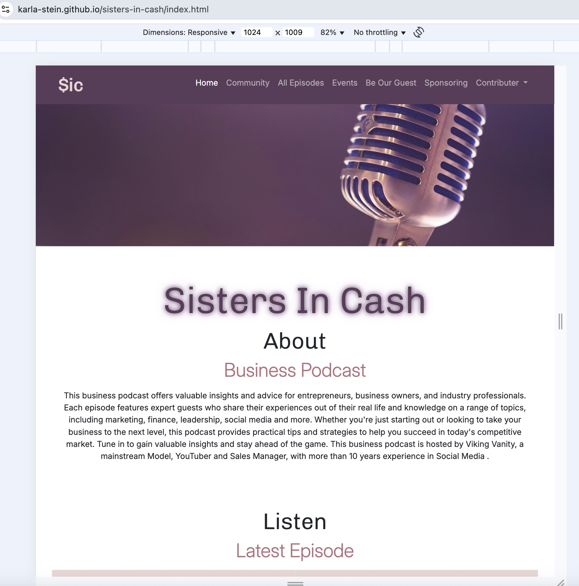
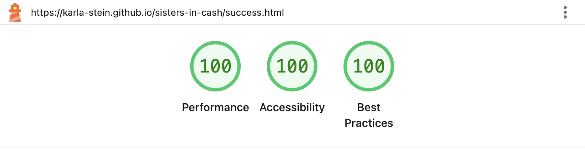

# Testing 

> **Note:** Return to the [README](README.md) for full project context.

## Code Validation

### HTML

I have used the recommended [HTML W3C Validator](https://validator.w3.org) to validate all of my HTML files.

| Directory | File | URL | Screenshot | 
| --- | --- | --- | --- | 
|  | [index.html](https://karla-stein.github.io/sisters-in-cash/index.html) | [HTML Validator](https://validator.w3.org/nu/?doc=https%3A%2F%2Fkarla-stein.github.io%2Fsisters-in-cash%2Findex.html) |  | 
|  | [all-episodes.html](https://karla-stein.github.io/sisters-in-cash/all-episodes.html) | [HTML Validator](https://validator.w3.org/nu/?doc=https%3A%2F%2Fkarla-stein.github.io%2Fsisters-in-cash%2Fall-episodes.html) |  | 
|  | [sponsor.html](https://karla-stein.github.io/sisters-in-cash/sponsor.html) | [HTML Validator](https://validator.w3.org/nu/?doc=https%3A%2F%2Fkarla-stein.github.io%2Fsisters-in-cash%2Fsponsor.html) |  | 
|  | [success.html](https://karla-stein.github.io/sisters-in-cash/success.html) | [HTML Validator](https://validator.w3.org/nu/?doc=https%3A%2F%2Fkarla-stein.github.io%2Fsisters-in-cash%2Fsuccess.html) |  | 
|  | [404.html](https://karla-stein.github.io/sisters-in-cash/404.html) | [HTML Validator](https://validator.w3.org/nu/?doc=https%3A%2F%2Fkarla-stein.github.io%2Fsisters-in-cash%2F404.html) |  | 

### CSS

I have used the recommended [CSS Jigsaw Validator](https://jigsaw.w3.org/css-validator) to validate my CSS file.

| Directory | File | URL | Screenshot | Notes
| --- | --- | --- | --- | --- |
| assets | [style.css](https://github.com/Karla-Stein/sisters-in-cash/assets/css/style.css) | [CSS Validator](https://jigsaw.w3.org/css-validator/validator?uri=https%3A%2F%2Fkarla-stein.github.io%2Fsisters-in-cash%2Fassets%2Fcss%2Fstyle.css&profile=css3svg&usermedium=all&warning=1&vextwarning=&lang=en) |  | 
|  |  |  | | The CSS file passed validation successfully with only 3 non-critical warnings related to CSS custom properties. These warnings indicate that variables declared using var() cannot be statically validated, which is expected behavior and does not affect functionality or performance. |

### JavaScript

Before converting to JavaScript, the all-episodes code was done in pure HTML, which can be found in the historical [all-episodes-old.html](https://github.com/Karla-Stein/sisters-in-cash/blob/4e6855ab94d5b5a321338d08e6b81e45b43c9f61/all-episodes-old.html). With the help of PerplexityAI and my mentor Tim, he helped refactor all of the raw (non-DRY) HTML code into a re-usable JavaScript modal, which also helped increase the page-load speed having one dynamic embedded iframe for the podcast, instead of dozens.

I have used the recommended [JSHint](https://jshint.com/) to validate my JavaScript files.

| Directory | File | Screenshot | Notes
| --- | --- | --- | --- |
| assets | [navbar.js](https://karla-stein.github.io/sisters-in-cash/assets/js/navbar.js) |  | No warnings
| assets | [episodes.js](https://karla-stein.github.io/sisters-in-cash/assets/js/episodes.js) |  | No warnings

## Responsiveness

I've tested my deployed project to check for responsiveness issues.

| Page | Mobile | Tablet | Desktop | Notes |
| --- | --- | --- | --- | --- |
| Home |  |  |  | Works as expected |
| All Episodes |  |  |  | Works as expected |
| Sponsoring |  |  |  | Works as expected |
| Success |  |  |  | Works as expected |
| 404 |  |  |  | Works as expected |

## Browser Compatibility

I've tested my deployed project on multiple browsers to check for compatibility issues.

| Page | Chrome | Firefox | Safari | Notes |
| --- | --- | --- | --- | --- |
| Home |  |  |  | Works as expected |
| All Episodes |  |  |  | Works as expected |
| Sponsoring |  |  |  | Works as expected |
| Success |  |  |  | Works as expected |
| 404 |  |  |  | Works as expected |

## Lighthouse Audit

I've tested my deployed project using the Lighthouse Audit tool to check for any major issues. Some warnings are outside of my control, and mobile results tend to be lower than desktop.

| Page | Mobile | Desktop |
| --- | --- | --- |
| Home |  |  |
| All Episodes|  |  |
| Sponsoring |  |  |
| Success |  |  |
| 404 |  |  |

## Defensive Programming

Defensive programming was manually tested with the below user acceptance testing:

### Sponsor Form

The sponsor form collects details from potential sponsors. Inputs are required where necessary and must not accept empty or invalid data. Manual testing was performed to ensure all validations work correctly, and the form behaves securely under different input scenarios.

| Field | Expected | Testing | Result | Screenshot |
| --- | --- | --- | --- | --- |
| **First Name** | Required. Must not accept empty input. | Tried submitting form without entering a name. | Submission blocked with required field warning. |  |
| **Last Name** | Required. Must not accept empty input. | Tried submitting form without entering a name. | Submission blocked with required field warning. |  |
| **Company** | Required. Must not accept empty input. | Tried submitting form without entering a name. | Submission blocked with required field warning. |  |
| **Company Website** | Required. Must not accept empty input.| Tried submitting form without entering data. | Submission blocked with required field warning. |  |
| | Must accept valid URL | Tried entering invalid data. | Submission blocked with expected data prompt. |  |
| **Contact Number** | Required. Must not accept empty input. | Tried submitting without a number. | Submission blocked with required field warning. |  |
| **Email** | Required. Must not accept empty.| Tried submitting without data. | Submission blocked with required field warning. |  |
| | Must be in a valid email format. | Tried submitting with wrong data. | Submission blocked with expected data prompt. |  |
| **Message** | Required. Must not accept empty input. | Tried submitting without a message. | Submission blocked due to missing required content. |  |
| **Submit Button** | Should only submit if all validations pass. | Filled required fields with valid data and submitted. | Form submitted successfully and expected confirmation shown. |  |

### Be Our Guest Form

| Field | Expected | Testing | Result | Screenshot |
| --- | --- | --- | --- | --- |
| **Name** | Required. Must not accept empty input. | Tried submitting form without entering a name. | Submission blocked with required field warning. |  |
| **Instagram Link** | Required. Must not accept empty input.| Tried submitting form without entering data. | Submission blocked with required field warning. |  |
| | Must accept valid URL | Tried entering invalid data. | Submission blocked with expected data prompt. |  |
| **Contact Number** | Required. Must not accept empty input. | Tried submitting without a number. | Submission blocked with required field warning. |  |
| **Email** | Required. Must not accept empty.| Tried submitting without data. | Submission blocked with required field warning. |  |
| | Must be in a valid email format. | Tried submitting with wrong data. | Submission blocked with expected data prompt. |  |
| **Message** | Required. Must not accept empty input. | Tried submitting without a message. | Submission blocked due to missing required content. |  |
| **Submit Button** | Should only submit if all validations pass. | Filled required fields with valid data and submitted. | Form submitted successfully and expected confirmation shown. |  |

#### Summary

- **Expected**: All required inputs must be filled with valid data before submission.  
- **Testing**: Attempted to submit with missing and invalid input data.  
- **Result**: Validations correctly blocked submission in all invalid scenarios.  
- **Fixes**: No issues found. Used `required` attributes and appropriate input `type=""` settings to ensure input validation.

## User Story Testing

## Bugs

### Fixed Bugs

### Unfixed Bugs

### Known Issues

