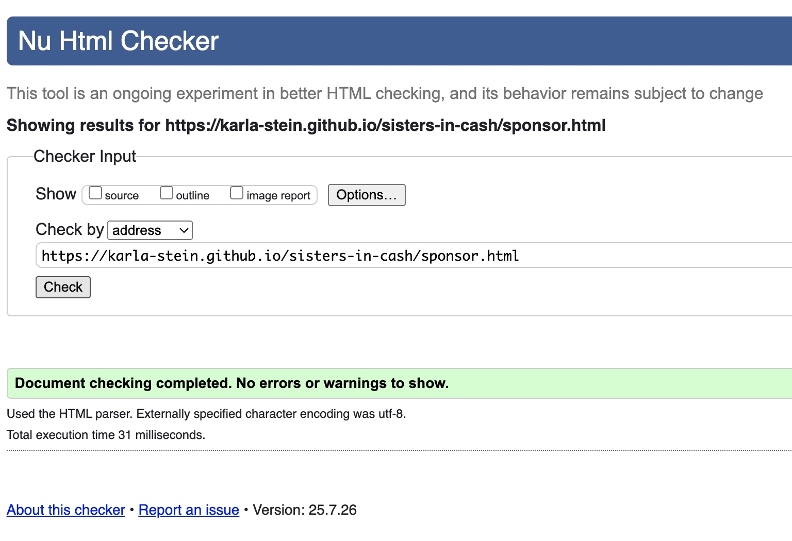
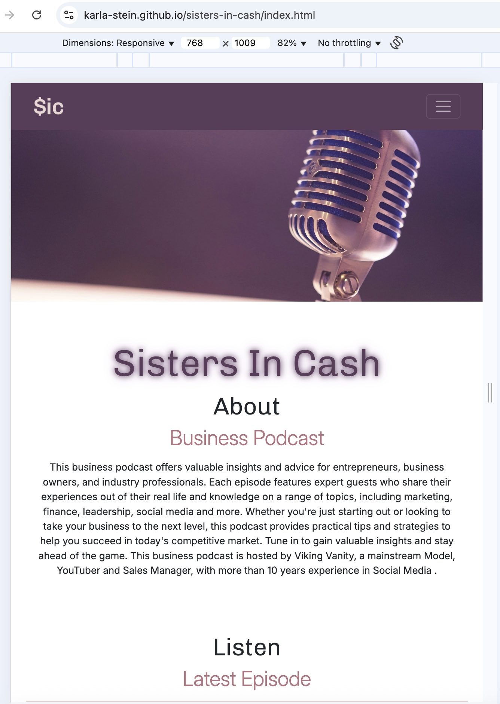
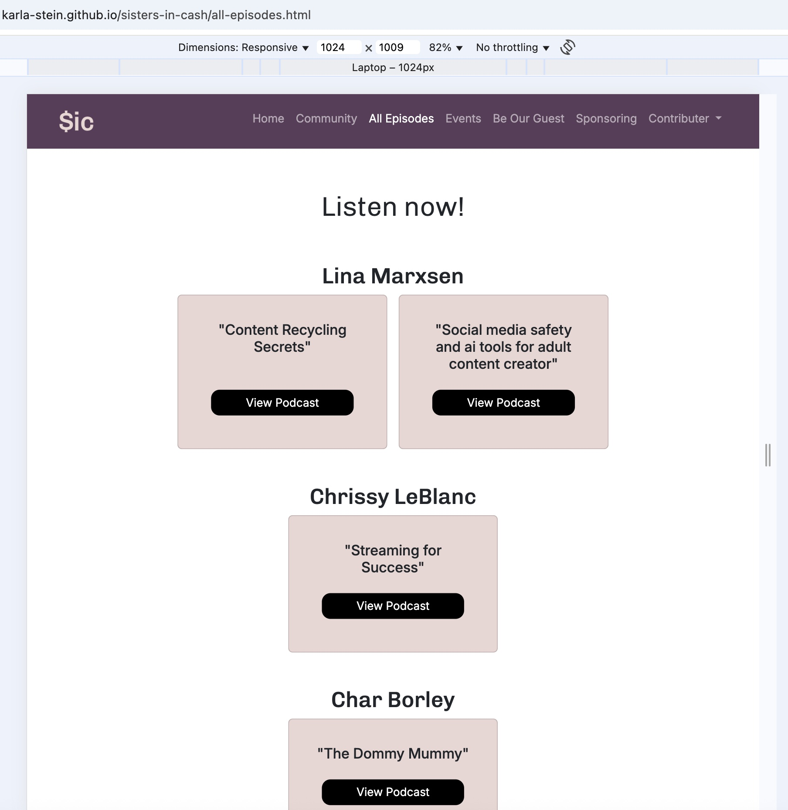
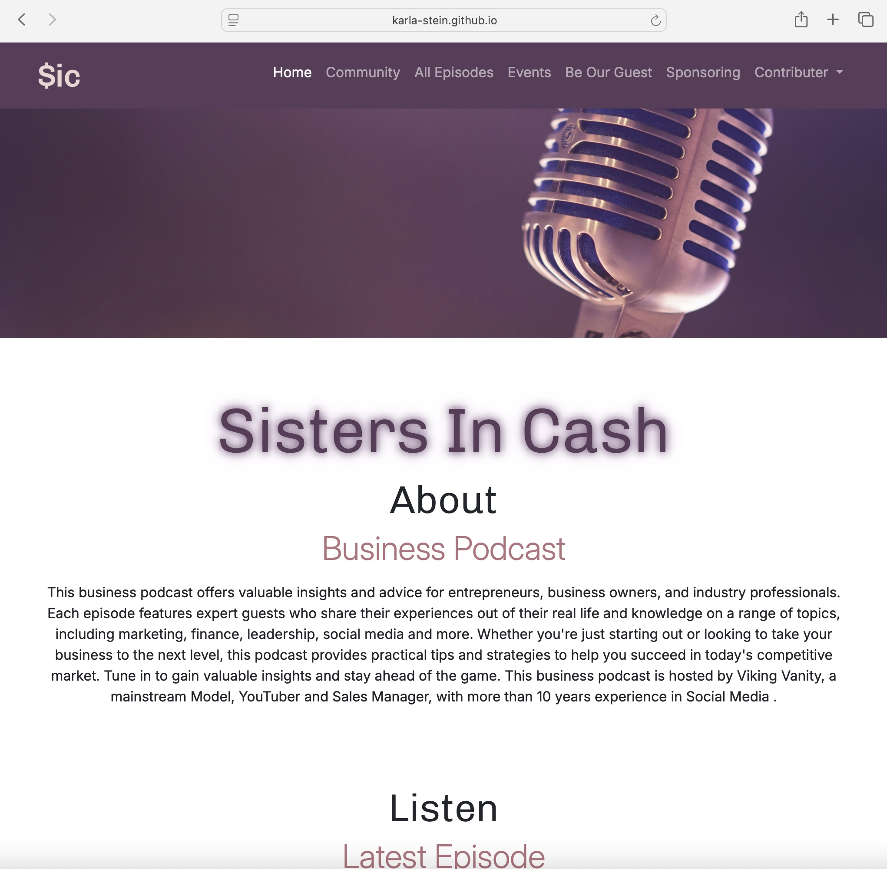
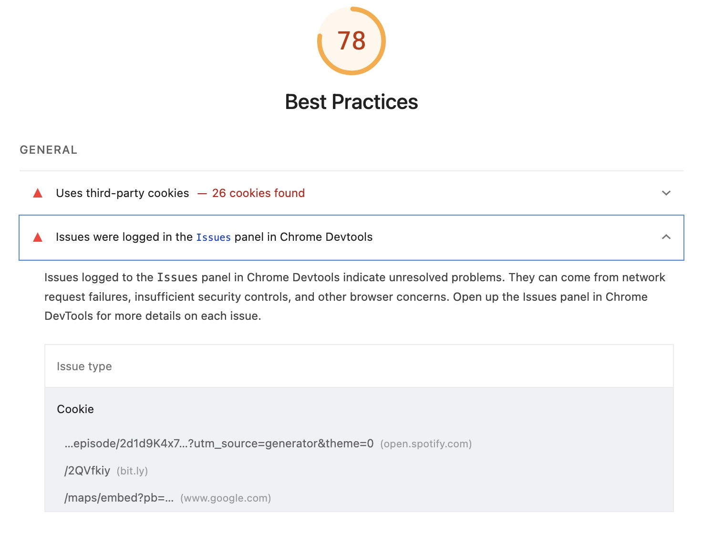
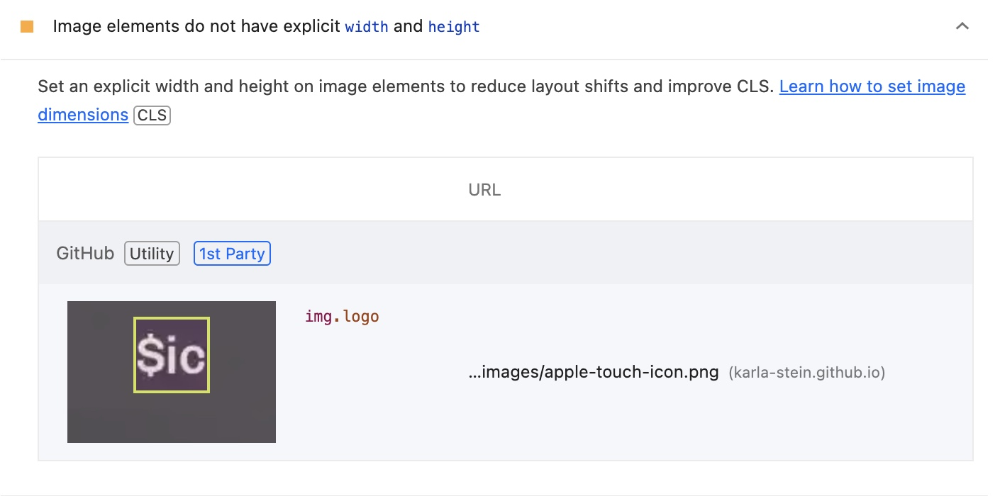

# Testing 

> **Note:** Return to the [README](README.md) for full project context.

## Code Validation

### HTML

I have used the recommended [HTML W3C Validator](https://validator.w3.org) to validate all of my HTML files.

| Directory | File | URL | Screenshot | 
| --- | --- | --- | --- | 
|  | [index.html](https://karla-stein.github.io/sisters-in-cash/index.html) | [HTML Validator](https://validator.w3.org/nu/?doc=https%3A%2F%2Fkarla-stein.github.io%2Fsisters-in-cash%2Findex.html) |  | 
|  | [all-episodes.html](https://karla-stein.github.io/sisters-in-cash/all-episodes.html) | [HTML Validator](https://validator.w3.org/nu/?doc=https%3A%2F%2Fkarla-stein.github.io%2Fsisters-in-cash%2Fall-episodes.html) |  | 
|  | [sponsor.html](https://karla-stein.github.io/sisters-in-cash/sponsor.html) | [HTML Validator](https://validator.w3.org/nu/?doc=https%3A%2F%2Fkarla-stein.github.io%2Fsisters-in-cash%2Fsponsor.html) |  | 
|  | [success.html](https://karla-stein.github.io/sisters-in-cash/success.html) | [HTML Validator](https://validator.w3.org/nu/?doc=https%3A%2F%2Fkarla-stein.github.io%2Fsisters-in-cash%2Fsuccess.html) |  | 
|  | [404.html](https://karla-stein.github.io/sisters-in-cash/404.html) | [HTML Validator](https://validator.w3.org/nu/?doc=https%3A%2F%2Fkarla-stein.github.io%2Fsisters-in-cash%2F404.html) |  | 

### CSS

I have used the recommended [CSS Jigsaw Validator](https://jigsaw.w3.org/css-validator) to validate my CSS file.

| Directory | File | URL | Screenshot | Notes
| --- | --- | --- | --- | --- |
| assets | [style.css](https://github.com/Karla-Stein/sisters-in-cash/assets/css/style.css) | [CSS Validator](https://jigsaw.w3.org/css-validator/validator?uri=https%3A%2F%2Fkarla-stein.github.io%2Fsisters-in-cash%2Fassets%2Fcss%2Fstyle.css&profile=css3svg&usermedium=all&warning=1&vextwarning=&lang=en) |  | 
|  |  |  | | The CSS file passed validation successfully with only 3 non-critical warnings related to CSS custom properties. These warnings indicate that variables declared using var() cannot be statically validated, which is expected behavior and does not affect functionality or performance. |

### JavaScript

Before converting to JavaScript, the all-episodes code was done in pure HTML, which can be found in the historical [all-episodes-old.html](https://github.com/Karla-Stein/sisters-in-cash/blob/4e6855ab94d5b5a321338d08e6b81e45b43c9f61/all-episodes-old.html). With the help of PerplexityAI and my mentor Tim, he helped refactor all of the raw (non-DRY) HTML code into a re-usable JavaScript modal, which also helped increase the page-load speed having one dynamic embedded iframe for the podcast, instead of dozens.

I have used the recommended [JSHint](https://jshint.com/) to validate my JavaScript files.

| Directory | File | Screenshot | Notes
| --- | --- | --- | --- |
| assets | [navbar.js](https://karla-stein.github.io/sisters-in-cash/assets/js/navbar.js) |  | No warnings
| assets | [episodes.js](https://karla-stein.github.io/sisters-in-cash/assets/js/episodes.js) |  | No warnings

## Responsiveness

I've tested my deployed project to check for responsiveness issues.

| Page | Mobile | Tablet | Desktop | Notes |
| --- | --- | --- | --- | --- |
| Home |  |  |  | Works as expected |
| All Episodes |  |  |  | Works as expected |
| Sponsoring |  |  |  | Works as expected |
| Success |  |  |  | Works as expected |
| 404 |  |  |  | Works as expected |

## Browser Compatibility

I've tested my deployed project on multiple browsers to check for compatibility issues.

| Page | Chrome | Firefox | Safari | Notes |
| --- | --- | --- | --- | --- |
| Home |  |  |  | Works as expected |
| All Episodes |  |  |  | Works as expected |
| Sponsoring |  |  |  | Works as expected |
| Success |  |  |  | Works as expected |
| 404 |  |  |  | Works as expected |

## Lighthouse Audit

I've tested my deployed project using the Lighthouse Audit tool to check for any major issues. Some warnings are outside of my control, and mobile results tend to be lower than desktop.

| Page | Mobile | Desktop |
| --- | --- | --- |
| Home |  |  |
| All Episodes|  |  |
| Sponsoring |  |  |
| Success |  |  |
| 404 |  |  |

## Defensive Programming

Defensive programming was manually tested with the below user acceptance testing:

### Sponsor Form

The sponsor form collects details from potential sponsors. Inputs are required where necessary and must not accept empty or invalid data. Manual testing was performed to ensure all validations work correctly, and the form behaves securely under different input scenarios.

| Field | Expected | Testing | Result | Screenshot |
| --- | --- | --- | --- | --- |
| **First Name** | Required. Must not accept empty input. | Tried submitting form without entering a name. | Submission blocked with required field warning. |  |
| **Last Name** | Required. Must not accept empty input. | Tried submitting form without entering a name. | Submission blocked with required field warning. |  |
| **Company** | Required. Must not accept empty input. | Tried submitting form without entering a name. | Submission blocked with required field warning. |  |
| **Company Website** | Required. Must not accept empty input.| Tried submitting form without entering data. | Submission blocked with required field warning. |  |
| | Must accept valid URL | Tried entering invalid data. | Submission blocked with expected data prompt. |  |
| **Contact Number** | Required. Must not accept empty input. | Tried submitting without a number. | Submission blocked with required field warning. |  |
| **Email** | Required. Must not accept empty.| Tried submitting without data. | Submission blocked with required field warning. |  |
| | Must be in a valid email format. | Tried submitting with wrong data. | Submission blocked with expected data prompt. |  |
| **Message** | Required. Must not accept empty input. | Tried submitting without a message. | Submission blocked due to missing required content. |  |
| **Submit Button** | Should only submit if all validations pass. | Filled required fields with valid data and submitted. | Form submitted successfully and expected confirmation shown. |  |

### Be Our Guest Form

| Field | Expected | Testing | Result | Screenshot |
| --- | --- | --- | --- | --- |
| **Name** | Required. Must not accept empty input. | Tried submitting form without entering a name. | Submission blocked with required field warning. |  |
| **Instagram Link** | Required. Must not accept empty input.| Tried submitting form without entering data. | Submission blocked with required field warning. |  |
| | Must accept valid URL | Tried entering invalid data. | Submission blocked with expected data prompt. |  |
| **Contact Number** | Required. Must not accept empty input. | Tried submitting without a number. | Submission blocked with required field warning. |  |
| **Email** | Required. Must not accept empty.| Tried submitting without data. | Submission blocked with required field warning. |  |
| | Must be in a valid email format. | Tried submitting with wrong data. | Submission blocked with expected data prompt. |  |
| **Message** | Required. Must not accept empty input. | Tried submitting without a message. | Submission blocked due to missing required content. |  |
| **Submit Button** | Should only submit if all validations pass. | Filled required fields with valid data and submitted. | Form submitted successfully and expected confirmation shown. |  |

#### Summary

- **Expected**: All required inputs must be filled with valid data before submission.  
- **Testing**: Attempted to submit with missing and invalid input data.  
- **Result**: Validations correctly blocked submission in all invalid scenarios.  
- **Fixes**: No issues found. Used `required` attributes and appropriate input `type=""` settings to ensure input validation.

## User Story Testing

The following table outlines how the key user stories defined at the start of this project were successfully implemented and manually tested. Each entry connects a real user need to a specific feature or section on the website, and includes a screenshot to demonstrate its presence and functionality.

These tests help confirm that the website meets its intended goals from the user’s perspective, ensuring clarity and usability.

| Target | Expectation | Outcome | Screenshot | 
| --- | --- | --- | --- | 
| As a content creator | I want to easily find new podcast episodes | so that I can learn from my peers’ tactics and real experiences. |  |
| As a new user	| I want to easily find the community links | so that I can benefit from exclusive insights shared within the community.|  |
| As a new user	| I need to find links to external resources | so that I can verify the credibility of the podcast or its guests. |  |
| As a sponsor | I need to find a contact form | so that I can express interest in sponsoring the podcast.|  |
| As an industry peer	 | I need to find a contact form | so that I can express interest in being featured as a guest. |  |
| As a sponsor | I need to view a list of featured guest speakers	 | so that I can evaluate if they align with my brand or product before sponsoring. |  |
| As an industry peer | I need to view upcoming events	 | so that I can decide if I want to participate or collaborate. |  |
| As a user | I want to see a custom 404 error page when I land on a broken or non-existent link | so I know I’ve made a mistake and can easily navigate back to the site. |  |
| As a new user	 | I want to view a carousel of community images in the community section | so I can get a visual sense of the people, vibe, and value of joining the network. |  |
| As a user interested in attending events| I want to view a map with the event location | so I can easily understand where it’s taking place and plan my visit. |  |

## Warnings

During the final stages of this project, I ran several Lighthouse audits to evaluate performance, accessibility and best practice. This process highlighted several warnings that didn’t break the functionality but impacted the overall user experience.

These were valuable learning moments. Rather than ignoring them, I investigated each one and applied fixes where possible — balancing practicality, performance, and best practice.

The tables below outline the main warnings I encountered and how I addressed each one:

### Fixed Warnings

| Warning | Solution | Screenshot
| --- | --- | --- |
| Uses deprecated APIs | This warning occurred because an `<h1>` tag was placed inside a `<section>` without an explicitly defined font-size. Although I removed the Bootstrap `display-1` class and targeted the `<h1>` using custom CSS and media queries, the warning remained. After several attempts, I replaced the `<section>` tag with a `
`, which resolved the issue and significantly improved my Best Practices score on all pages. |  |

### Unfixed Warnings

| Warning | Justification | Screenshot |
| --- | --- | --- |
| Third-Party Cookies | This warning is caused by third-party embeds (Spotify, Google Maps, Bit.ly) which use their own cookies. Since I don’t control these external services, the issue can’t be resolved on my end.|  |
| Properly size images  | Despite setting a custom CSS size and trying .webp format, the warning persisted and overall performance worsened. I reverted to the original image since my final Lighthouse score remained above 90, which I considered an acceptable outcome. |   |
| Eliminate render-blocking resources | These resources come from trusted third-party services like Bootstrap and Google Fonts. I don’t control how they load, and therefore this warning is out of my control. |  |
| Largest Contentful Paint element | I addressed this warning by resizing, reformatting and preloading the hero image in the <head> of the HTML to improve load priority. While the issue isn’t fully resolved, the render delay has significantly decreased, and overall Largest Contentful Paint (LCP) timing has improved. Since the performance score now falls within an acceptable range, I chose not to make further changes.|  |
| | |  |
| Reduce unused CSS | The unused CSS comes from Bootstrap and Font Awesome, which are included via CDN for convenience and development speed. While not all styles are used, the overall impact on performance is minimal. Since the site consistently achieves high Lighthouse scores, I decided to take no further action. |  |

## Tidy Up

As a final step before submission, I revalidated the HTML and CSS Javascript to ensure that all recent code changes maintained compliance with best practices and accessibility standards. I also completed a last round of tidy-ups.
Following fixes were made:

- Labeled all implemented or borrowed code for clarity and attribution
- Removed redundant and unused code for a cleaner codebase
- Fixed broken navigation links on the 404 and success pages
- Updated content requirements in README to match project expectations
- Refined the user flow section in the README to clearly demonstrate the step-by-step journey a user takes when navigating the site.
- Added target and rel to the social links on the episodes page.
- Added target and rel to community button.

> [!IMPORTANT]  
> There are no remaining bugs that I am aware of, though, even after thorough testing, I cannot rule out the possibility that a minor issue may still exist under specific conditions.

